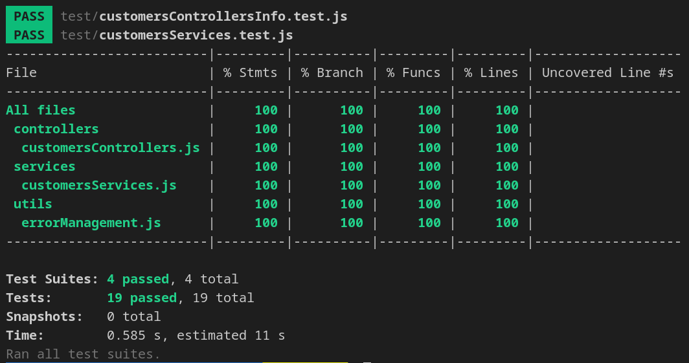
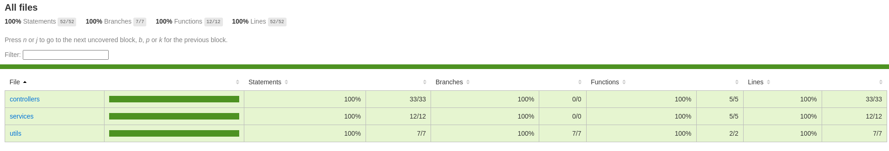

# Tests unitarios de backend con Jest


## Descripción:

El objetivo de este repositorio es llevar a cabo el testing de un proyecto sencillo mediante el uso del framework Jest.
Jest es una herramienta de testing desarrollada por Facebook e ideada inicialmente para testear aplicaciones realizadas con React aunque, a día de hoy, es apto para ser utilizado en cualquier proyecto de Javascript y trabajar con código tanto en el lado del frontend como en el lado del backend.
Podemos encontrar la documentación de Jest en el siguiente enlace: https://jestjs.io/
También es muy recomendable revisar a fondo el repositorio de Github cuyo enlace dejamos a continuación: https://github.com/facebook/jest#getting-started

## Breve introducción al testing:

En el ámbito del desarrollo de proyectos tenológicos, el testing de las funcionalidades que se desarrollan es un aspecto esencial de cara a la puesta en producción.
Cuando vamos a testear una aplicación web hecha con Javascript podemos realizar diferentes tipos de test:

- Tests unitarios:

Este tipo de tests comprueban porciones de nuestro código. En nuestro caso, lo que vamos a hacer en este backend va a ser testear los servicios, los controladores y las funciones que tenemos dentro de la carpeta de utilidades.

- Tests de integración:

Los tests de integración comprueban que varios fragmentos de código interactúan correctamente entre ellos. El ejemplo más típico sería un función que durante su ejecución realiza una llamada a otra función.

- Tests end to end:

Comprueban el funcionamiento del servicio al completo con todo lo que ello implica (rellenar una base de datos de prueba, levantar un servidor específico para el test, ejecutar toda la secuencia necesaria para comprobar todas las funcionalidades).

## Configuración del testing dentro del proyecto:

La configuración de Jest destaca por ser especialmente secilla:

- En primer lugar, instalaremos Jest en nuestro proyecto como una dependencia de desarrollo mediante el comando:

```sh
npm i --save-dev jest
```

- El siguiente paso será indicar en el archivo package.json de nuestro proyecto que vamos a realizar los test empleando Jest. Para ello modificaremos el contenido de la propiedad "scripts" de la siguiente manera:

```js
"scripts": {
  "test": "jest"
}
```

## Ejemplo básico de test:

Vamos a realizar un test de prueba para confirmar el proceso se ha realizado correctamente.

En primer lugar, crearemos un un archivo .js dentro de nuestro proyecto (yo llamé al mío suma.js). En este archivo crearemos una función (en mi caso se trata de una función que recibe dos números como parámetros y devuelve la suma de ambos) para después exportarla. El contenido del archivo quedó de la siguiente manera:

```js
const suma = (num1, num2) => {
  return num1 + num2;
};

module.exports = { suma };
```

Lo siguiente que haremos será crear un archivo con extensión .test.js y testear la función. Para ello, la importaremos y llamaremos a la función "test". Esta función recibe dos argumentos. El primer argumento es el título de nuestro test y el segundo es un callback en cuyo cuerpo se ejucatará el test propiamente dicho.

```js
const { suma } = require("./suma");

test("Suma", () => {
  expect(suma(2, 3)).toEqual(5);
});
```

A continuación lanzaremos desde nuestra terminal el comando:

```sh
npm run test
```

Acto seguido, comprobaremos que la ejecución del comando nos devuelve que el test ha sido pasado con éxito:


## Descripción de las partes baśicas de nuestro código de testing:

Un test que se albergan dentro de nuestros ficheros .test.js se componen de la siguiente manera:

### Matchers:

Un matcher es la una condición que debe cumplirse para que un test pase. Estos elementos se encuentran ubicados al final del cuerpo del callback de cada test y están compuestos por una función expect() que recibe como argumento lo que queremos comparar y a la que se le concatenan otros métodos a su vez que constituirán el segundo elemento de la comparación.

Un ejemplo de matcher sería:

```js
expect(suma(2, 3)).toEqual(5);
```

### Test:

Cada unidad de test que creemos se manifetará como una llamada a la función test() la cual, recibirá como argumentos el título del test, en primer lugar y, en segundo lugar, un callback en cuyo cuerpo se encontrará en contenido del test incluyendo los matchers de los que hemos hablado en el apartado anterior.

Un test se vería de la siguiente manera:

```js
test("Suma", () => {
  expect(suma(2, 3)).toEqual(5);
});
```

### Describe:

La función describe se nos permite agrupar una suite o colección de tests. El describe recibe como primer argumento el nombre de la colección de tests y como segundo argumento un callback en cuyo cuerpo se van a encontrar los tests perteneciente a ese grupo.

```js
describe("Grupo de tests", () => {
  test("Primer test", () => {
    expect(2 + 2).toBe(4);
  });

  test("Primer test", () => {
    expect(2 - 2).toBeFalsy();
  });
});
```

### Importaciones de todos los métodos que vayamos a testear:

El formato de nuestras importaciones dependerá de la extensión de Javascript con la que estemos trabajando. En este caso, estamos trabajando con CommonJS de modo que la sintaxis que utilizaremos será la siguiente:

```js
const { suma } = require("./suma.js");
```

### Mocks:

El concepto de mock es, básicamente, la sustitución de una pieza de código por otra que nosotros decidamos. Esto lo hacemos con el objetivo de testear únicamente el código de la funcionalidad y no incluir en el mismo llamadas a otras apis, a otras a funciones o consultas a una base de datos.

Jest incorpora un método específico para esta tarea llamanda mock().

Los mocks se suelen incluir al principio de los archivos de test y reciben como argumentos, en primer lugar, la ruta del archivo en el que se encuentran las funcionalidades que vamos a reemplazar y, en segundo lugar, un callback que devuelve un objeto en el que cada propiedad es el number de una funcionalidad a sustituir y que tiene como valor la función que se va a ejecutar en su lugar.

Vamos a ver, a continuación, un ejemplo de mock para un servicio de backend:

Este servico customersService realiza una llamada a una función getCustomers() que hace una cosulta a una base de datos:

```js
const customersService = async () => {
  return await getCustomers();
};
```

Para ejecutar un test unitario a este código lo más aconsejable es mockear getcustomers y para hacerlo construiríamos nuestro test de la siguiente forma:

```js
jest.mock("../database/queries", () => {
  const testCustomer = {
    name: "Luis",
    vip: true,
  };

  return {
    getCustomers: () => {
      return [testCustomer];
    },
  };
});

const { customersService } = require("../services/customersServices");

describe("Services controllers testing", () => {
  test("Customers", async () => {
    const response = await customersService();

    expect(response[0].name).toEqual("Luis");
    expect(response[0].vip).toEqual(true);
  });
});
```

Detalles importantes a tener en cuenta:

- Como ya hemos mencionado, el mock debe realizarse al principio del documento para que las funcionalidades que queremos sustituir queden reemplazadas de manera correcta.

- El mock tiene su propio scope. Esto significa que si queremos utilizar un paquete dentro del mock, tendremos que hacer el require en su interior. Al mismo tiempo, también tenemos que saber que lo declarado dentro del mock no podrá ser llamado fuera.

- Cuando indicamos en el primer argumento del mock la ruta que queremos testear debemos tener en cuenta que todo el contenido del archivo al que apuntamos va a ser mockeado. Por este motivo, es aconsejable, que todos los elementos "mockeables" se encuetren agrupados.

- En la misma línea del punto anterior y, con el objetivo de facilitarmos el trabajo, es aconsejable abstraer ciertas partes de nuestro código. Un ejemplo de ello son las consultas a la base de datos.

## Coverage:

La cobertura de test o coverage es un pará metro que nos permite conocer que porcentaje de nuestro código se encuentra sometido a nuestras pruebas.

Es muy común, que los repositorios remotos tengan ramas protejidas (sobretodo producción y pre-producción) a las cuales tan sólo podremos mergear si nuestro código cumple con una serie de requisitos. Uno de estos requisitos suele ser el cumplimiento de un mínimo porcentaje de cobertura de test.

Para saber que porcentaje de nuestro código se encuentra bajo test, Jest nos ofrece la herramienta coverage. Podemos incorporar esta funcionalidad añadiendo a la ejecución de nuestro comando jest la opción --coverage. Esto lo podemos hacer en el package.json y nos quedará de la siguiente manera:

```js
"test": "jest --coverage"
```

Ahora, cuando ejecutemos nuestros tests, nos aparecerá en nuestra terminal una tabla indicando los porcentajes código probado dentro de los archivos que estamos testeando:



Al mismo tiempo, se nos generará en la raíz de nuestro proyecto una carpeta llamada coverage que contendrá el contenido necesario para visualizar la información de nuestra cobertura en el navegador ejecutando el archivo index.html que se encuentra en su interior.


