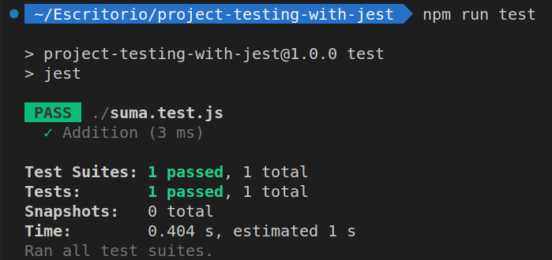

# Testeo de un proyecto con Jest


## Introducción

El objetivo de este repositorio es llevar a cabo el testing de un proyecto sencillo mediante el uso del framework Jest.
Jest es una herramienta de testing desarrollada por Facebook e ideada inicialmente para testear aplicaciones realizadas con React aunque, a día de hoy, es apto para ser utilizado en cualquier proyecto de Javascript y trabajar con código tanto en el lado del frontend como en el lado del backend.
Podemos encontrar la documentación de Jest en el siguiente enlace: https://jestjs.io/
También es muy recomendable revisar a fondo el repositorio de Github cuyo enlace dejamos a continuación: https://github.com/facebook/jest#getting-started

## Configuración:

La configuración de Jest destaca por ser especialmente secilla:

- En primer lugar, instalaremos Jest en nuestro proyecto como una dependencia de desarrollo mediante el comando:

```sh
npm i --save-dev jest
```

- El siguiente paso será indicar en el archivo package.json de nuestro proyecto que vamos a realizar los test empleando Jest. Para ello modificaremos el contenido de la propiedad "scripts" de la siguiente manera:

```js
"scripts": {
  "test": "jest"
}
```

## Ejemplo básico de test:

Vamos a realizar un test de prueba para confirmar el proceso se ha realizado correctamente.

En primer lugar, crearemos un un archivo .js dentro de nuestro proyecto (yo llamé al mío suma.js). En este archivo crearemos una función (en mi caso se trata de una función que recibe dos números como parámetros y devuelve la suma de ambos) para después exportarla. El contenido del archivo quedó de la siguiente manera:

```js
const suma = (num1, num2) => {
  return num1 + num2;
};

module.exports = { suma };
```

Lo siguiente que haremos será crear un archivo con extensión .test.js y testear la función. Para ello, la importaremos y llamaremos a la función "test". Esta función recibe dos argumentos. El primer argumento es el título de nuestro test y el segundo es un callback en cuyo cuerpo se ejucatará el test propiamente dicho.

```js
const { suma } = require("./suma");

test("Suma", () => {
  expect(suma(2, 3)).toEqual(5);
});
```

A continuación lanzaremos desde nuestra terminal el comando:

```sh
npm run test
```

Acto seguido, comprobaremos que la ejecución del comando nos devuelve que el test ha sido pasado con éxito:



## Descripción de las partes de nuestro código de testing:

Un test que se albergan dentro de nuestros ficheros .test.js se componen de la siguiente manera:

### Matchers:

Un matcher es la una condición que debe cumplirse para que un test pase. Estos elementos se encuentran ubicados al final del cuerpo del callback de cada test y están compuestos por una función expect() que recibe como argumento lo que queremos comparar y a la que se le concatenan otros métodos a su vez que constituirán el segundo elemento de la comparación.

Un ejemplo de matcher sería:

```js
expect(suma(2, 3)).toEqual(5);
```

### Test:

Cada unidad de test que creemos se manifetará como una llamada a la función test() la cual, recibirá como argumentos el título del test, en primer lugar y, en segundo lugar, un callback en cuyo cuerpo se encontrará en contenido del test incluyendo los matchers de los que hemos hablado en el apartado anterior.

Un test se vería de la siguiente manera:

```js
test("Suma", () => {
  expect(suma(2, 3)).toEqual(5);
});
```

### Describe:

La función describe se nos permite agrupar una suite o colección de tests. El describe recibe como primer argumento el nombre de la colección de tests y como segundo argumento un callback en cuyo cuerpo se van a encontrar los tests perteneciente a ese grupo.

```js
describe("Grupo de tests", () => {
  test("Primer test", () => {
    expect(2 + 2).toBe(4);
  });

  test("Primer test", () => {
    expect(2 - 2).toBeFalsy();
  });
});
```

### Importaciones de todos los métodos que vayamos a testear:

El formato de nuestras importaciones dependerá de la extensión de Javascript con la que estemos trabajando. En este caso, estamos trabajando con CommonJS de modo que la sintaxis que utilizaremos será la siguiente:

```js
const { suma } = require("./suma.js");
```
